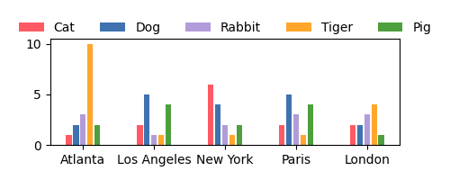
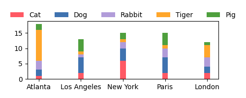
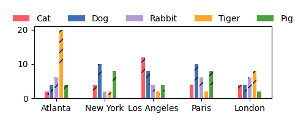
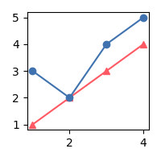

## Bar chart
```bash
# 2D bar chart
python bar_plot.py --data-path sample_data/bar_multi1.txt
# stack 2D bar chart
python bar_plot.py --data-path sample_data/bar_multi1.txt --stack
# 3D bar chat
python 3dbar_plot.py --data-path sample_data/3dbar_multi1.txt
```




## Line chart
```bash
python line_plot.py --data-path sample_data/line.txt
```
